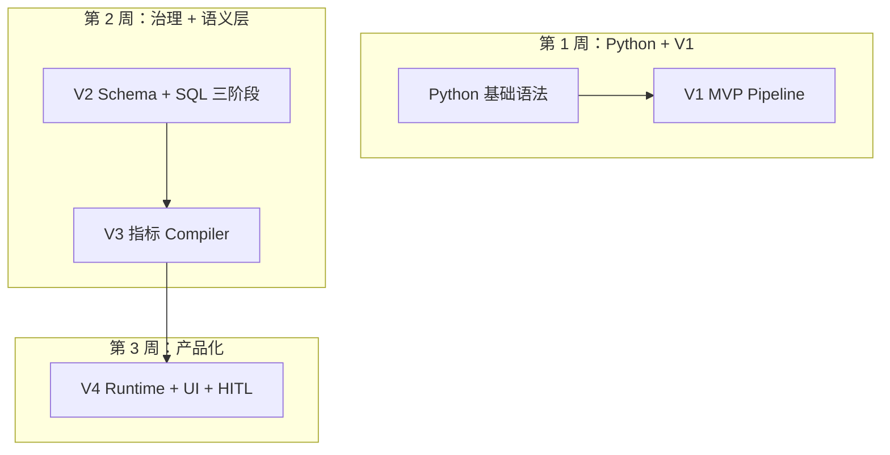

# V1→V4 学习大纲：Python + AI 应用工程

> 按 **7～14 天** 自学节奏设计。每天 1～2 小时，先跑通再读代码。  
> 代码内已标注 `【学习】` 注释，与本大纲章节对应。

---

## 总览：你在学什么

| 维度 | 内容 |
|------|------|
| **Python** | 模块导入、`dataclass`、类型注解、`pathlib`、环境变量、JSON、正则、异步基础 |
| **AI 应用** | Prompt → Agent → 结构化 JSON → Pipeline 编排 → 语义层 → 产品化 Runtime |
| **数据** | Mock OLAP、Doris 协议、Schema 目录、指标注册表、确定性 SQL 编译 |
| **框架** | [Camel-AI](https://github.com/camel-ai/camel) `ChatAgent` / `Task`；V4 自研 Skill + Hook + FastAPI |



---

## 阶段 0：环境与第一次运行（半天）

**目标**：零密钥跑通闭环，建立直觉。

```bash
cd ai-ops-assistant-v1
pip install -r requirements.txt
python main.py "最近7天用户流失情况如何？"
python main.py --json   # 看 trace 里各阶段输出
python -m mock_data.verify
```

**对照阅读**（按顺序）：

1. `ai-ops-assistant-v1/main.py` — CLI 入口、`argparse`
2. `ai-ops-assistant-v1/workflow/ops_workflow.py` — 五阶段 Pipeline
3. 终端输出的 Markdown 报告 ← 最终产物

**自检**：能说出「问题从哪进、报告从哪出、中间有几个 Agent」。

---

## 阶段 1：Python 必备（1～2 天）

结合 V1 代码学，不必单独刷教程。

| 知识点 | 在本仓库中的例子 |
|--------|------------------|
| 包与 `sys.path` | `main.py` 把项目根加入 `sys.path` |
| `from __future__ import annotations` | 所有 `*.py` 顶部，支持前向类型引用 |
| `@dataclass(frozen=True)` | `config.py` 的 `Settings` |
| 类型注解 `Dict[str, Any]` | Agent 的 `run(payload) -> Dict` 约定 |
| `pathlib.Path` | `config.py`、`schema_retriever.py` |
| `os.getenv` + `python-dotenv` | `.env` → `get_settings()` |
| `json.dumps(..., ensure_ascii=False)` | Agent 输入输出、trace |
| 正则 `re.search` | `query_understanding_agent._mock_understand` |
| 可选类型 `Optional[T]` | 配置项、依赖注入 |

**练习**：

- 改 `query_understanding_agent._mock_understand`，让「活跃度」映射到新 `intent`
- 在 `--json` 输出里找到 `trace["sql_generation"]["mock_plan"]`

---

## 阶段 2：V1 — Agent + 固定 Pipeline（2～3 天）

**架构问题**：运营一句话如何变成报告？

**阅读顺序**：

| 顺序 | 文件 | 学什么 |
|------|------|--------|
| 1 | `config.py` | 配置集中、Mock 开关逻辑 |
| 2 | `agents/_camel_runtime.py` | **Camel-AI 核心 API**（见下表） |
| 3 | `agents/query_understanding_agent.py` | Agent 模式：Mock / LLM 双路径 |
| 4 | `agents/sql_generation_agent.py` | Text-to-SQL（V1 允许 LLM 写 SQL） |
| 5 | `tools/sql_tool.py` + `tools/doris_client.py` | Tool 边界：结构化 dict 进出的「假 SQL 执行」 |
| 6 | `agents/analysis_agent.py`、`report_agent.py` | 下游分析与报告 |
| 7 | `prompts/*.txt` | Prompt 工程：系统提示 vs 用户 payload |
| 8 | `workflow/ops_workflow.py` | 编排：`trace`、阶段顺序 |

### Camel-AI 方法速查（V1 `_camel_runtime.py`）

| API | 作用 |
|-----|------|
| `ModelFactory.create(...)` | 按平台/模型名创建 LLM 后端 |
| `ChatAgent(system_message=..., model=...)` | 带系统提示的对话 Agent |
| `BaseMessage.make_user_message(...)` | 构造用户消息 |
| `agent.step(msg)` | **单轮**推理，返回 `response.msg.content` |
| `Task` / `TaskState` | OWL 思想：任务实体与状态（本仓库用于 trace） |

### Agent 统一约定

```python
def run(payload: Dict[str, Any]) -> Dict[str, Any]:
    # 输入、输出都是 JSON-serializable 的 dict
    # settings.use_mock_agents 为 True 时走确定性 Mock，不调 API
```

**练习**：

1. 配置 `OPENAI_API_KEY`，关闭 Mock，对比真实 LLM 与 Mock 的 `trace` 差异  
2. 画一张五阶段数据流图（`user_question` → `understanding` → `sql_bundle` → `query_result` → `analysis` → `markdown`）

**V1 的局限（为 V2/V3 埋伏笔）**：

- LLM 可直接写 SQL → 易幻觉列名、漏分区  
- Mock 不解析 SQL，靠 `mock_plan` 路由 → 真实 Doris 需替换

---

## 阶段 3：V2 — Schema 治理 + SQL 三阶段 + 缓存（2 天）

**架构问题**：如何减少「瞎写 SQL」？

**阅读顺序**：

| 顺序 | 文件 | 学什么 |
|------|------|--------|
| 1 | `schema/catalog.yaml` | 表/列/分区/指标语义 |
| 2 | `tools/schema_retriever.py` | YAML + `DESCRIBE` 合并 → Prompt 上下文 |
| 3 | `agents/sql_planner_agent.py` | 逻辑计划（非终稿 SQL） |
| 4 | `agents/sql_optimizer_agent.py` | 分区、`LIMIT` 等加固 |
| 5 | `agents/sql_execution_agent.py` | 执行与 explain |
| 6 | `workflow/owl_workflow.py` | `OpsWorkflowState`、阶段缓存 |
| 7 | `workflow/cache.py` | `StageCache.memo`、`stable_hash` |
| 8 | `workflow/state.py` | 状态对象字段 |

### 新增 Python/工程概念

| 概念 | 位置 |
|------|------|
| `yaml.safe_load` | `schema_retriever`、`metrics/loader` |
| LRU 缓存 `OrderedDict` | `workflow/cache.py` |
| 高阶函数 `Callable[[], T]` | `cache.memo(..., compute)` |
| 依赖注入 | `OWLWorkflow(schema_retriever=..., cache=...)` |

**对比 V1**：SQL 从 1 个 Agent → 3 个 Agent；多了 `schema_context` 注入。

**练习**：

- 在 `catalog.yaml` 加一列说明，观察 Planner 上下文是否变长（`--json` 里 `schema_context`）
- 同一问题连跑两次，看 `cache_hits` 哪些阶段为 `true`

---

## 阶段 4：V3 — 语义层 + 指标驱动（2～3 天）

**架构问题**：能否 **禁止 LLM 写可执行 SQL**？

**核心原则**：LLM 只选指标与意图；SQL 由 **Compiler** 从 `registry.yaml` 模板拼装。

**阅读顺序**：

| 顺序 | 文件 | 学什么 |
|------|------|--------|
| 1 | `metrics/registry.yaml` | `sql_template`、`source_table`、`dimensions` |
| 2 | `metrics/loader.py` | 加载与白名单校验 |
| 3 | `agents/metric_agent.py` | 指标选择（仍在 LLM 侧） |
| 4 | `semantic_layer/semantic_planner.py` | `query_plan` 逻辑结构 |
| 5 | `semantic_layer/sql_compiler.py` | **确定性** `compile_query_plan` |
| 6 | `semantic_layer/term_map.yaml` + `term_mapping.py` | 业务术语 → 指标 ID |
| 7 | `workflow/owl_workflow.py` | `OWLSemanticWorkflow` |

### Compiler 安全规则（必读注释）

- 标识符白名单 `_safe_ident`
- 表达式字符集 `_safe_sql_expression`（防注入片段）

**练习**：

- 在 `registry.yaml` 增加指标 `paying_users`，跑 `main.py` 问「付费用户」
- 故意在 template 里写 `;`，看 Compiler 如何 `_reject`

---

## 阶段 5：V4 — Agent Native 产品（3～4 天）

**架构问题**：CLI 如何变成运营可用的 **会话 + 可视化 + 人在回路**？

**阅读顺序（后端）**：

| 顺序 | 文件 | 学什么 |
|------|------|--------|
| 1 | `backend/main.py` | FastAPI + uvicorn 入口 |
| 2 | `backend/api/routes.py` | REST + **SSE** Hook 流 |
| 3 | `backend/runtime/agent_runtime.py` | Session、Workflow YAML、HITL 闸门 |
| 4 | `backend/runtime/session_state.py` | `SessionPhase` 状态机 |
| 5 | `backend/skill_engine/executor.py` | 动态加载 `scripts/run.py` |
| 6 | `backend/skill_engine/skills/*/SKILL.md` | 声明式 Skill |
| 7 | `backend/skill_engine/skills/*/workflow.yaml` | 步骤与 outputs |
| 8 | `backend/hook_engine/dispatcher.py` | 生命周期事件 |
| 9 | `backend/model_adapter/adapter.py` | 多 Provider 统一接口 |

**阅读顺序（前端，选读）**：

- `frontend/src/App.tsx` — 三栏布局
- `frontend/src/hooks/useSSE.ts` — 订阅推理时间线

### V4 与 Camel 的关系

V4 **不再**用 `ChatAgent` 流水线，而用 **Skill 脚本 + ModelAdapter**；业务语义层仍复用 V3 的 `metrics/`、`semantic_layer/`。

### FastAPI / 异步要点

| API | 用途 |
|-----|------|
| `@app.post("/api/sessions")` | 创建会话 |
| `StreamingResponse` + SSE | Hook 审计推送 |
| `async def handle_message` | Runtime 异步编排 |

**练习**：

1. 双终端启动 backend + frontend（见 V4 README）  
2. 提问后在右侧看 Hook 时间线  
3. 在 HITL 闸门点「修改指标」，观察 `edit_metrics` 重跑 `compile-and-query`

---

## 能力矩阵：学完应能回答

| 问题 | 答案位置 |
|------|----------|
| Mock Agent 何时启用？ | `config.get_settings()`，无 API Key 则 True |
| V1 数据怎么查出来的？ | `mock_plan.op` → `DorisClient.fetch_by_plan` |
| V2 Schema 如何进 Prompt？ | `SchemaRetriever.build_prompt_context` |
| V3 SQL 谁写的？ | `sql_compiler.compile_query_plan`，不是 LLM |
| V4 为何暂停？ | `AgentRuntime._gate_after` → HITL `SessionPhase` |
| trace 存在哪？ | V1 `OpsWorkflow.trace`；CLI `--json` 打印 |

---

## 推荐学习路径（压缩版 7 天）

| 天 | 内容 | 命令/文件 |
|----|------|-----------|
| D1 | 跑 V1 + 读 `main` / `ops_workflow` | `python main.py --json` |
| D2 | Camel runtime + Query/SQL Agent | `_camel_runtime.py` |
| D3 | Tool + Mock 数据 | `doris_client.py`, `mock_data/` |
| D4 | V2 Schema + Planner | `catalog.yaml`, `owl_workflow.py` |
| D5 | V2 缓存 + V3 registry | `cache.py`, `registry.yaml` |
| D6 | V3 Compiler + 对比 V1 SQL | `sql_compiler.py` |
| D7 | V4 Runtime + UI + HITL | `agent_runtime.py`, 浏览器三栏 |

---

## 延伸资源

- [Camel-AI 文档](https://docs.camel-ai.org/)
- [OWL 编排思想](https://github.com/camel-ai/owl) — 本仓库用固定 DAG 模拟，注释中说明了如何换成 `Workforce`
- Text-to-SQL 治理：Semantic Layer / Metric Store 业界实践（dbt Metric Layer、Headless BI）

---

## 代码注释索引（`【学习】` 标记）

| 版本 | 已加注文件 |
|------|------------|
| V1 | `main.py`, `config.py`, `workflow/ops_workflow.py`, `agents/_camel_runtime.py`, `agents/query_understanding_agent.py`, `agents/sql_generation_agent.py`, `tools/doris_client.py` |
| V2 | `workflow/cache.py`, `workflow/owl_workflow.py`（文件头与关键阶段） |
| V3 | `semantic_layer/sql_compiler.py` |
| V4 | `runtime/agent_runtime.py`, `skill_engine/executor.py` |

读到无注释文件时，优先对照同名的 V1/V2 版本差异。
