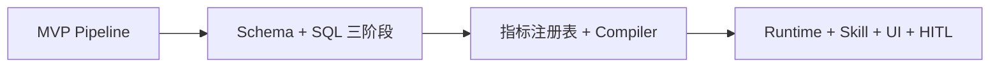

# AI 运营助手实验室（ai-ops-assistant-lab）

面向**游戏运营 / 数据分析**场景的实验仓库：演示如何用 **Python + Camel-AI + OWL 编排思想 + Doris（可 Mock）** 把运营同学的**自然语言问题**变成可审计的 **SQL → 洞察 → Markdown 报告**，并沿 V1→V4 逐步演进到 **指标语义层、Agent Runtime、Skill/Hook 与人在回路（HITL）** 的产品形态。

> 本仓库是**教学与架构实验**，非生产级 BI 平台；各版本可独立运行，便于对照学习。

## 项目目的与作用

| 目标 | 说明 |
|------|------|
| **验证链路** | 证明「NL → 可控取数 → 分析 → 报告」在离线 Mock 下可一键跑通 |
| **对比架构** | 同一业务域下并排展示：直连 SQL、Schema 约束、指标编译、Agent Native UI |
| **沉淀模式** | 固定 Pipeline、阶段缓存、指标白名单、Skill 声明式、Hook 可观测 |
| **降低试错成本** | 默认 Mock LLM + Mock Doris，无需密钥即可演示 |

适用读者：数据平台 / 运营分析 / AI 应用工程师，以及希望将 **Text-to-SQL 收敛到语义层与治理** 的团队。

## 版本一览

| 目录 | 定位 | 详细文档 |
|------|------|----------|
| [`ai-ops-assistant-v1/`](./ai-ops-assistant-v1/) | **MVP**：Query → SQL（Mock）→ Analysis → Report | [README](./ai-ops-assistant-v1/README.md) |
| [`ai-ops-assistant-v2/`](./ai-ops-assistant-v2/) | **Doris + Schema**：SQL Planner / Optimizer 三阶段 + `catalog.yaml` | [README](./ai-ops-assistant-v2/README.md) |
| [`ai-ops-assistant-v3/`](./ai-ops-assistant-v3/) | **语义层 + 指标驱动**：Metric → Planner → SQL Compiler（禁止 LLM 直出 SQL） | [README](./ai-ops-assistant-v3/README.md) |
| [`ai-ops-assistant-v4/`](./ai-ops-assistant-v4/) | **Agent Native**：Runtime + Skill/Hook + 多模型 + React 三栏 UI + HITL | [README](./ai-ops-assistant-v4/README.md) |

建议环境：**Python 3.10+**；V4 另需 **Node.js 18+**（前端）。

## 演进路线（V1 → V4）



### V1：证明闭环

- **问题**：运营能否用一句话拿到报告？
- **做法**：Camel Agent + 固定五阶段 `OpsWorkflow`，SQL 由 Agent 生成，数据走 Mock。
- **收获**：端到端 trace、提示词与 Agent 边界清晰。

### V2：治理 SQL 生成

- **问题**：模型容易忽略分区、乱 join、幻觉列名。
- **做法**：`catalog.yaml` 注入 Schema；SQL 拆成 Planner → Optimizer → Execution；`StageCache` 缓存中间阶段。
- **收获**：可连接真实 Doris；Schema 成为第一道「硬约束」。

### V3：指标即 API

- **问题**：即便有 Schema，LLM 仍可能写出不符合口径的 SQL。
- **做法**：`metrics/registry.yaml` 白名单 + `sql_compiler` 确定性拼装；LLM 只选指标与意图。
- **收获**：SQL 可审计、可版本管理；语义层与术语表 `term_map.yaml` 对齐业务语言。

### V4：产品化与可观测

- **问题**：CLI 无法支撑运营日常协作、指标确认与过程透明。
- **做法**：FastAPI + React 三栏；`AgentRuntime` 驱动声明式 Skill；`Hook Engine` SSE 时间线；查询后 **HITL** 确认指标再出报告。
- **收获**：多模型适配、会话状态、审计日志；复用 V3 指标与编译逻辑。

## 快速体验

**CLI（以 V1 为例，无需 API Key）：**

```bash
cd ai-ops-assistant-v1
pip install -r requirements.txt
python main.py "最近7天用户流失情况如何？"
python main.py --json
```

**Web UI（V4）：**

```bash
# 终端 1
cd ai-ops-assistant-v4/backend && pip install -r requirements.txt
python -m uvicorn main:app --reload --port 8000

# 终端 2
cd ai-ops-assistant-v4/frontend && npm install && npm run dev
# 打开 http://localhost:5173
```

各版本 `main.py` 与 `.env.example` 用法见对应目录 README。

## Mock 数据说明

V1～V3（及 V4 backend）共用演示表 **`game_daily_metrics`**、**`order_daily_summary`**：各 **14 个交易日**（`2026-04-07`～`2026-04-20`），支持「最近 7 天」「最近 14 天」等问法。

```bash
cd ai-ops-assistant-v1
python -m mock_data.verify
```

## 环境与密钥

复制各版本目录下的 `.env.example` 为 `.env`，按需填写 OpenAI / Doris 等。**切勿将 `.env` 提交到 Git**（根目录 `.gitignore` 已忽略）。

## 未来可能的演进方向

| 方向 | 说明 |
|------|------|
| **动态编排** | 接入 [camel-ai/owl](https://github.com/camel-ai/owl) `Workforce`，在保持指标 Compiler 的前提下按问题拆分 Worker |
| **语义层产品化** | 指标版本、血缘、口径审批流；与 Metabase / Headless BI 对接 |
| **RAG + Schema** | 对历史 SQL、指标文档做检索增强，仍由 Compiler 落 SQL |
| **多租户与权限** | 按游戏 / 工作室隔离 registry 与 Doris 库表 |
| **评估与回归** | 黄金问题集 + SQL/结果 diff；Hook 审计用于线上抽检 |
| **协作与发布** | 报告模板市场、定时推送、飞书 / 钉钉 Bot（Skill 化） |
| **观测与成本** | Token / 阶段耗时仪表盘；缓存策略与模型路由策略可配置 |

以上方向在仓库中**尚未实现**，可作为 V5+ 实验议题。

## 开源许可

本项目采用 **MIT License**，见 [`LICENSE`](./LICENSE)。
